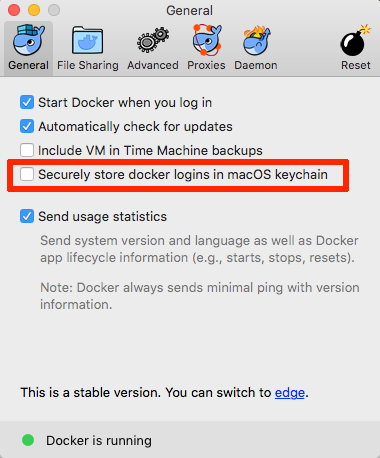

# Protected Images Secrets

Most examples require a running Kubernetes cluster. You can get the cluster up and running using our [Tutorial](https://github.com/Alfresco/alfresco-anaxes-shipyard/tree/master/docs/running-a-cluster.md) if you do not have one already.

For example, if your cluster is using protected Docker images at Quay.io your cluster must have access to a secret with credentials to be able to pull those images:

NOTE: If you're using Docker for Mac ensure your "Securely store docker logins in macOS keychain" preference is OFF (as shown in the diagram below) before running this step.



1. Login with Docker to Quay.io with your credentials:

```bash
docker login quay.io
```

2. Generate a base64 value for your dockercfg, this will allow Kubernetes to access quay.io

```bash
cat ~/.docker/config.json | base64
```

3. Create the file <code>secrets.yaml</code>. Insert the following into the file

```
apiVersion: v1
kind: Secret
metadata:
  name: quay-registry-secret
type: kubernetes.io/dockerconfigjson
data:
# Docker registries config json in base64 to do this just run - cat ~/.docker/config.json | base64
  .dockerconfigjson:
```

4. Add the base64 string generated in step 2 to <code>.dockerconfigjson</code> in <code>secrets.yaml</code>


5. Create your working namespace:

```bash
kubectl create namespace example
```

6. Create your secret in your previously defined namespace.

```bash
kubectl create -f secrets.yaml --namespace example
```

You should see the output below.

<pre>
secret "quay-registry-secret" created
</pre>
